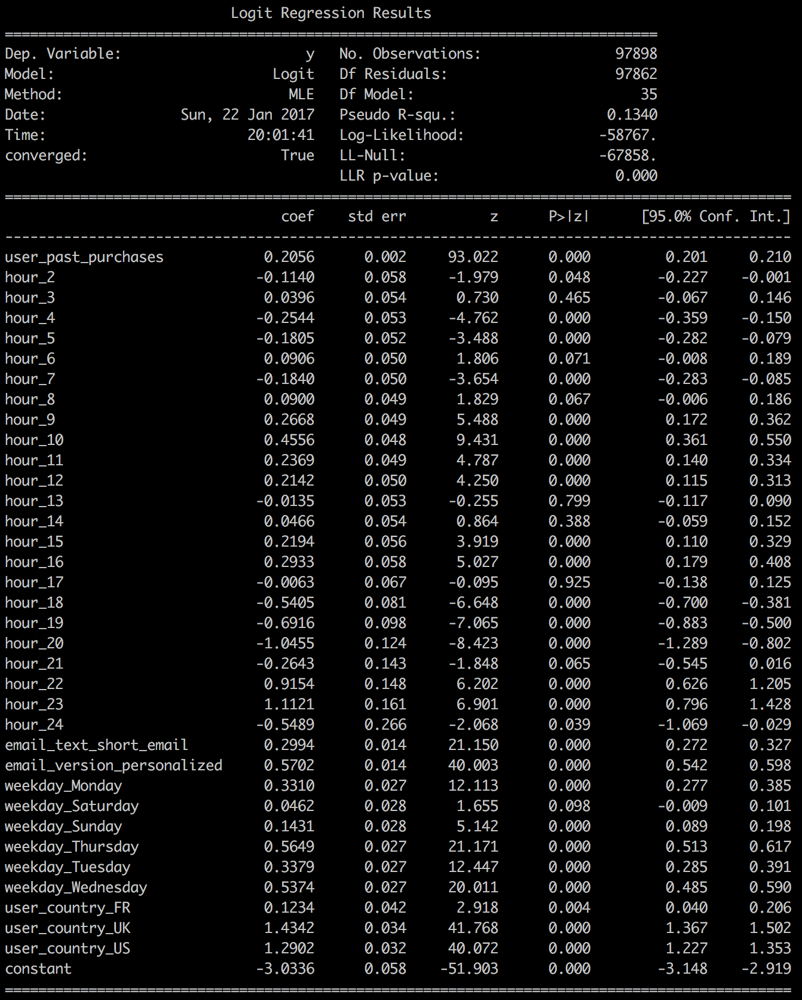
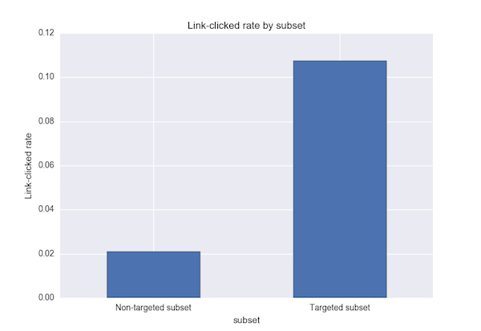

# Optimizing Email Marketing

This file walks the reader through my analysis of a common take home challenge, where the candidate is asked to optimize an email marketing campaign. I was able to devise a more intelligent way of sending out emails that has the potential to result in a 1000% increase in click-through rate, from 2% to over 22%. The prompt is contained in the file "prompt.pdf." The Python code I used for my analyses is contained in the file "take_home.py". Enjoy!

## Exploratory Data Analysis

First, I loaded the three tables into 3 separate Pandas DataFrames. My first step was to take a look at the contents of the tables by calling 'df.describe()' for each of these. From this, I saw that there weren't any missing values, which is nice. I then checked to make sure that the email ids were unique in each of the three tables, and found that they were.

After this, I plotted histograms of the continuous variables, and bar graphs of the categorical variables. Below, I summarize my results.

1. Hour of day: More emails were sent during the late morning and early afternoon than any other time (essentially, during the workday)                               
  

2. Number of past purchases: this graph was very right skewed, with the number of emails sent decreasing as a number of past items purchased. This could indicate that many users have not been very active on the site in terms of purchasing.

  

3. Country: approximately the same number of emails were sent in France and Spain, with more sent in the UK, and most sent in US (over 60%).

  

4. Length of email, type of email, and day of week had almost even distributions of counts across the categories

I now calculated the conversion rates of the emails, both for opening the email and clicking on the link. The results are as follows:

1. Email opening rate: 10.3%. Around 1 in 10 emails are opened.

2. Overall link-clicked rate: 2.1%. Only 1 out of 50 emails result in a link clicked

3. Link-clicked rate for opened emails: 20.5%. However, for every 5 emails opened, one link is clicked.

## In-depth Data Analysis

The plan: After taking a look at some of the summary statistics of the tables in both numerical and graphical format, I began working on a model to identify what characteristics of an email/user combination are associated with a higher chance of a link being clicked. I chose to work with a Logistic Regression model because of its ease of interpretability; the sign of the beta coefficients, combined with the p-value, can inform me as to which characteristics are associated with a higher chance of a link being clicked. My idea was to determine what these characteristics were, restrict the test portion of the dataset to emails that had those characteristics, and then calculate the link-clicked rate of that subset to estimate how the results of my model would improve the rate. Before fitting the model, I took into account three main considerations:

1. Avoiding overfitting. If I generated my parameter estimates using the entire dataset, then restricted the dataset to the desired characteristics, and finally calculated the link-clicked rate, I would be likely be overfitting, because my estimate of the improved link-clicked rate would be based upon the same sample that generated the beta coefficients. To deal with this, I created a test-train-split, with 50% of the data in each of the train and test splits. I chose this split because I was worried that in the end, when I restrict the test set to characteristics positively associated with link-clicked rate, I might not have a large enough sample to make a significant conclusion. Therefore I opted to have the test set be relatively large for this model.

2. Unbalanced classes. I had to take into account the extreme imbalance of the dataset; as noted above, only 1 in 50 observations were positive (meaning a link was clicked). I considered three approaches for this.
    1. SMOTE (Synthetic Minority Over-sampling Technique). This technique creates new observations of the minority class, with features interpolated from the existing minority observations. This can be preferential to simply oversampling from the minority class, as the learned model would then overfit to the specific examples of the minority class present in the train set. The drawback, of course, is that data is created that doesn't actually exist.

      Due to its interpolative nature, SMOTE is designed to work with continuous features, and if used with dummy variables will result in synthetic observations with values between 0 and 1 for what should be binary variables. I thus opted not to use SMOTE.

    2. Random majority under-sampling with replacement.  With this method, random observations from the majority class are chosen, with those not selected discarded from the analysis. This balances the data but has the main limitation of throwing out data. I built a model using this, and noticed that depending on the observations that were chosen, sometimes the beta coefficient for 'hour of day: 24' would have a huge standard error; even worse, sometimes the model wouldn't run at all, giving me a singular matrix error. After digging a little deeper, I discovered why this was happening. It turns out that of the 100,000 total emails, only 69 were sent at hour 24. So when doing the random under-sampling, sometimes it would happen that none of the emails sent at hour 24 were included in the sample. The resulting feature matrix thus had all 0s for that column, and was not full rank. Logistic regression solvers won't work for singular feature matrices, so this was an issue. Even if a few emails from hour 24 were included in the sample, the feature matrix was close enough to singular that it still posed problems for the solver, giving me huge variance estimates.

      With this in mind, I decided not to use random under-sampling, as I wanted a model that would work with the granularity of my time measurements.

    3. Random minority over-sampling with replacement. With this method, random observations from the minority class are added to the sample. This has the advantage of neither discarding data (under-sampling) nor artificially creating new data (SMOTE). However, the downside is that the model can overfit to the minority samples present in the data. I chose this method to build my model because of the limitations discussed earlier with 1. and 2.  

3. String coded categorical variables. I dummified hour of day (I considered it categorical rather than continuous to allow for a non-monotonic time effect), user country, email length, email type, and day of week.

With these issues taken care of, I ran a Logistic Regression. Below is a screenshot of the results (performed using statsmodels Logit model)

From this, the factors that were associated with higher click through rate were:

1. Hour of day - Looking at the hours of the day, I noticed that hours 10, 22, and 23 all had positive beta coefficients, and they were very significant. Perhaps at 10 AM people are getting into the work rhythm and checking their email frequently, whereas at 10 and 11 PM they might be checking their emails right before going to bed. So I decided when restricting the test set to include only these hours.

2. Past purchases - Looking at past purchases, since it is continuous, I decided to bin it by quartile to figure out above what threshold of previous item purchases to include from the test set; the upper quartile ended up being 6 or more items.
3. Shorter emails versus longer emails.

4. Personalized emails instead of generic emails.

5. Day of week - Sending emails Saturday through Thursday instead of Friday (The coefficients for Wednesday and Thursday were largest, so I decided to keep emails on those days).

6. Country - recipient being in the UK and US instead of France or Spain.

I now restricted the test set by the above characteristics, giving me 40 observations. Of these observations, the link_clicked rate was 23%, more than 10 times higher than the remaining observations of the test set! (2% link-clicked rate).

I then tested the significance of these results using a one sided Z-test for population proportions. While the sample size for the targeted subset was small (40), it was still large enough that the normal approximation to the binomial was appropriate (np = 40*.225 = 9, which is above the typical threshold of 5)

1. Null hypothesis: Targeted portion of test set has a lower than or equal proportion of links clicked than the non- targeted portion of test set.

2. Alternate hypothesis: Targeted portion of test set has greater proportion of links clicked than the non-targeted portion of test set.

The test was significant at the .05 level; the exact p_value was 0.0.

We can also compare these two populations from a Bayesian perspective, where the probabilities that generated the results in each of the two groups are considered to be random variables. If we assume a beta prior, then using the binomial likelihood function results in a beta posterior as well; that is, the beta distribution is a conjugate prior. Sampling from the resulting distribution and comparing the two samples to one another gives us a probability that my method of sending out emails is better than the random method. After performing this calculation, this probability was 100%. The estimated distributions of the probabilities are shown below. 

As expected from the 100% probability that the campaign performed better among the targeted subset than the non-targeted subset, there is essentially no overlap at all between the two distributions.

## Performance of campaign on different segments of users

I only have information on two user characteristics: country of IP address of signup, and number of past items purchased. The results of the logistic regression indicated that the campaign performed better in the UK and US than in France and Spain, and also that more user past purchases were associated with higher link clicked rate. Looking at the data in the test set, the raw proportions support this.

2.4% of the emails sent to the US and UK users resulted in a link clicked, versus 0.8% for Spain and France; this difference was significant according to the Z test for proportions. 4.4% of emails sent to users in the upper quartile of the previous items purchased resulted in links clicked, versus 2.0% for the other three quartiles; this difference was also significant. Note that since I am doing two tests here, both on country and items purchased quartile, I divided the traditional .05 alpha level by 2 (Bonferronni correction for multiple testing).

Bayesian methods, analogous to the previous analysis for the targeted subset, yielded 100% probabilities for both US and UK performing better and emails sent to users in the upper quartile of items purchased performing better, consistent with the conclusions of the Z tests.

##Business Recommendations/ Explicit Answers to Prompt Questions

I recommend that instead of sending emails out to random users, with random email characteristics, that emails only be sent to users in the U.S. and U.K, on Wednesday and Thursday, between 10 AM and 11 AM or from 10 PM to 12AM. These emails should only be sent to users who have previously purchased above six items. Furthermore, emails should all be of shorter length and personalized. Following these recommendations should result in a ten fold increase in link-clicked rates, from around 2% to over 22%.

Explicit answers to prompt questions:

1. What percentage of users opened the email and what percentage clicked on the link within the email?

    10.3% of emails were opened, 2.1% of emails resulted in links being clicked, and of the emails that were opened, 20.5% resulted in links being clicked.

2. The VP of marketing thinks that it is stupid to send emails to a random subset and in a random way. Based on all the information you have about the emails that were sent, can you build a model to optimize in future email campaigns to maximize the probability of users clicking on the link inside the email?

    The logistic regression model I built identifies the characteristics, both in terms of email style and user segment, that lead to higher chances of links being clicked on. The first paragraph in this section summarizes my recommendations.

3. By how much do you think your model would improve click through rate ( defined as # of users who click on the link / total users who received the email). How would you test that?

    If emails are sent out according to my recommendations, we can expect an increase from 2.1% to 22.5% link-clicked rate. These results were derived by training the logistic regression model on one portion of the data, and then applying the results to the remaining data. To test this, we could set up a trial where emails are sent to customers meeting the above characteristics, with the emails themselves also meeting the above characteristics, and then compare this to the previous random method. There are several methods for doing this sort of A/B testing: we could send out an equal number of emails according to the random method and according to my specifications, and then compare the proportions of link-clicked between the two groups either using frequentist methods (Z test for proportions) or Bayesian methods (utilizing a beta prior and posterior, as explained earlier). Alternatively, I could set up a multi-armed bandit strategy so that I could simultaneously compare the two methods while taking advantage of the one that performs better. If we adopt the Z test approach, I have calculated the necessary number of emails that need to be sent out to each group for different powers and alpha levels, assuming the results of this future test are similar to those found in the targeted and non-targeted groups from the current dataset.
    1. Power .8, alpha .05 : 29 emails sent to each group
    2. Power .9, alpha .05: 41 emails sent to each group
    3. Power .99, alpha .01: 102 emails sent to each group
4. Did you find any interesting pattern on how the email campaign performed for different segments of users? Explain.

    The campaign fared better in the US and UK than in France and Spain. The campaign was also more successful among users with larger numbers of previous purchases. One suggestion I have here is to allow new users access to special deals on items, so that they purchase more items and enter the company's pipeline faster. This will hopefully convert them quickly into the segment of users with larger numbers of previously purchased items, increasing the overall success of the campaign strategy.  

## Future work
Given the small number of emails required even for power = .99 and alpha = .01, a test of the sort I described in part 3 of the previous section should be implemented immediately to confirm the results of my analysis. Although I mentioned multi-armed bandit techniques earlier, the small cost of sending out 102 emails with potentially suboptimal characteristics is small enough that I don't think a simultaneous comparison and exploitation strategy is necessary.

I also encourage the company to begin collecting more user information, as currently there is only information on country of IP address at signup and and number of past purchases. For example, it would be helpful to see what types of items a user has purchased, to see if there is a correlation between that and link-clicked rate. Furthermore, having more user characteristics could allow for exploration of the interaction between user characteristics and email characteristics; perhaps certain types of emails work better for some types of users than others. This kind of exploration could open up the possibility of sending different types of emails to different types of users.
